# ЗАДАНИЕ
1. Используя команду cat в терминале операционной системы Linux, создать
   два файла Домашние животные (заполнив файл собаками, кошками,
   хомяками) и Вьючные животными заполнив файл Лошадьми, верблюдами и
   ослы), а затем объединить их. Просмотреть содержимое созданного файла.
   Переименовать файл, дав ему новое имя (Друзья человека).
2. Создать директорию, переместить файл туда.
3. Подключить дополнительный репозиторий MySQL. Установить любой пакет
   из этого репозитория.
4. Установить и удалить deb-пакет с помощью dpkg.
5. Выложить историю команд в терминале ubuntu
6. Нарисовать диаграмму, в которой есть класс родительский класс, домашние
   животные и вьючные животные, в составы которых в случае домашних
   животных войдут классы: собаки, кошки, хомяки, а в класс вьючные животные
   войдут: Лошади, верблюды и ослы).
7. В подключенном MySQL репозитории создать базу данных “Друзья
   человека”
8. Создать таблицы с иерархией из диаграммы в БД
9. Заполнить низкоуровневые таблицы именами(животных), командами
   которые они выполняют и датами рождения
10. Удалив из таблицы верблюдов, т.к. верблюдов решили перевезти в другой
    питомник на зимовку. Объединить таблицы лошади, и ослы в одну таблицу.
11. Создать новую таблицу “молодые животные” в которую попадут все
    животные старше 1 года, но младше 3 лет и в отдельном столбце с точностью
    до месяца подсчитать возраст животных в новой таблице
12. Объединить все таблицы в одну, при этом сохраняя поля, указывающие на
    прошлую принадлежность к старым таблицам.
13. Создать класс с Инкапсуляцией методов и наследованием по диаграмме.
14. Написать программу, имитирующую работу реестра домашних животных.
    В программе должен быть реализован следующий функционал:
    * 14.1 Завести новое животное
    * 14.2 определять животное в правильный класс
    * 14.3 увидеть список команд, которое выполняет животное
    * 14.4 обучить животное новым командам
    * 14.5 Реализовать навигацию по меню
15. Создайте класс Счетчик, у которого есть метод add(), увеличивающий̆
    значение внутренней переменной 1 при нажатие “Завести новое
    животное” Сделайте так, чтобы с объектом такого типа можно было работать в
    блоке try-with-resources. Нужно бросить исключение, если работа с объектом
    типа счетчик была не в ресурсном try и/или ресурс остался открыт. Значение
    считать в ресурсе try, если при заведения животного заполнены все поля.

#  РЕШЕНИЕ

    
1 и 2

    cat > pets
    cat > pack-animals
    cat pets pack-animals > animals
    cat animals
    mv animals human\ friends
    mkdir dir-animals
    mv human\ friends dir-animals/
    cat dir-animals/human\ friends

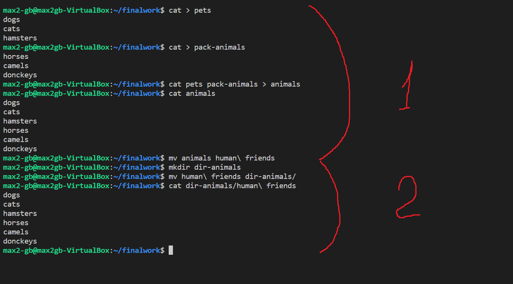

--- 

    
3 и 4

    sudo apt install mysql-client
    

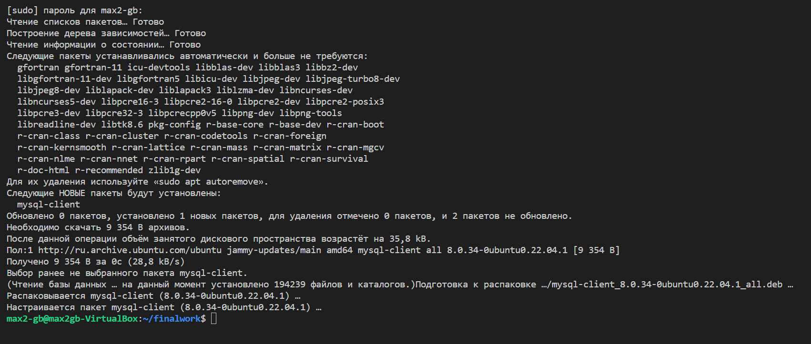

создаем файл __mysql.list__ 

    

    cd /etc/apt/sources.list.d/
    sudo touch mysql.list
    sudo nano mysql.list

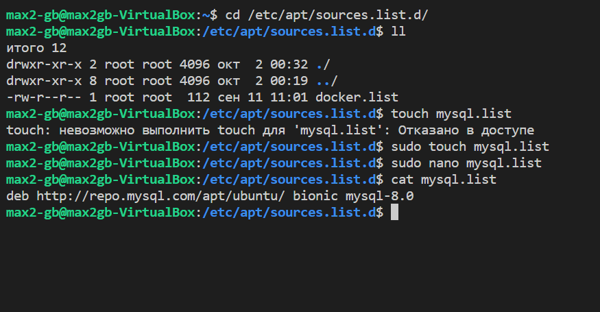

    
устанавливаем ключ и обновляем

    sudo apt-key adv __keyserver pgp.mit.edu --recv-keys 3A79BD29
    sudo apt update

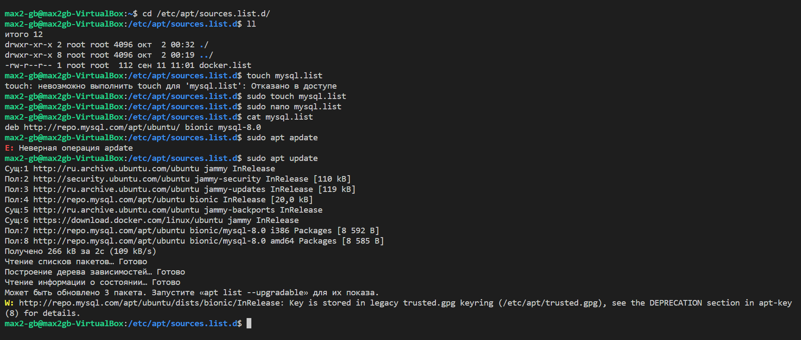

    
скачиваем  пакет deb через dpkg

    wget http://cz.archive.ubuntu.com/ubuntu/pool/main/e/ed/ed_1.18-1_amd64.deb
    

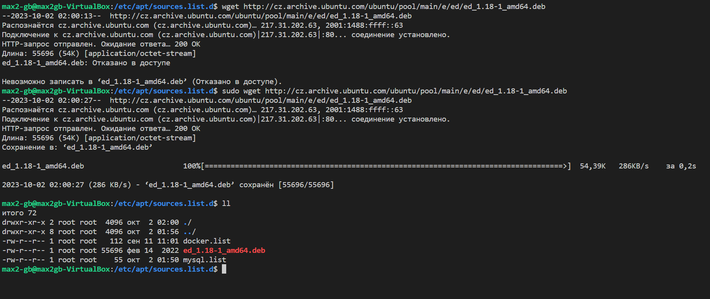

    
устанавливаем пакет,зависимости и удаляем

    sudo dpkg -i ed_1.18-1_amd64.deb
    sudo apt -f install
    sudo dpkg -r ed_1.18-1_amd64

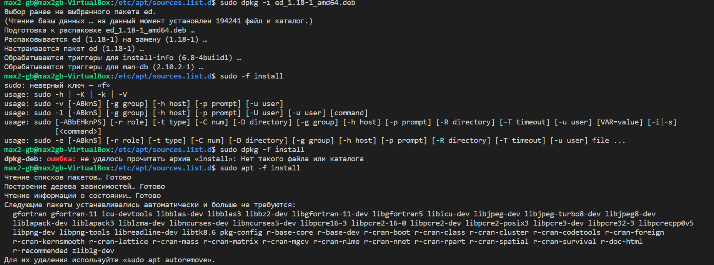

___

    
5

    история

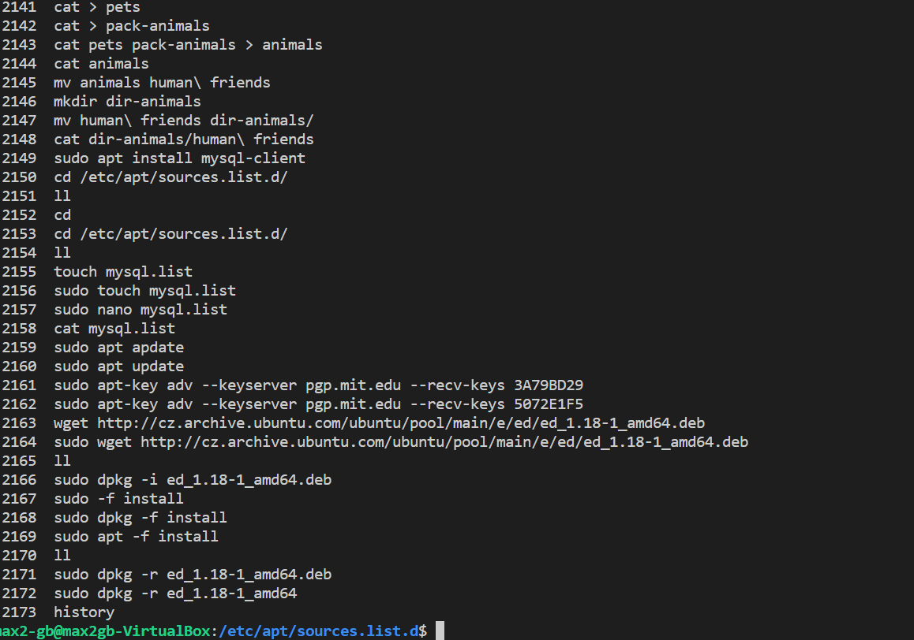

    
6

    диаграмма

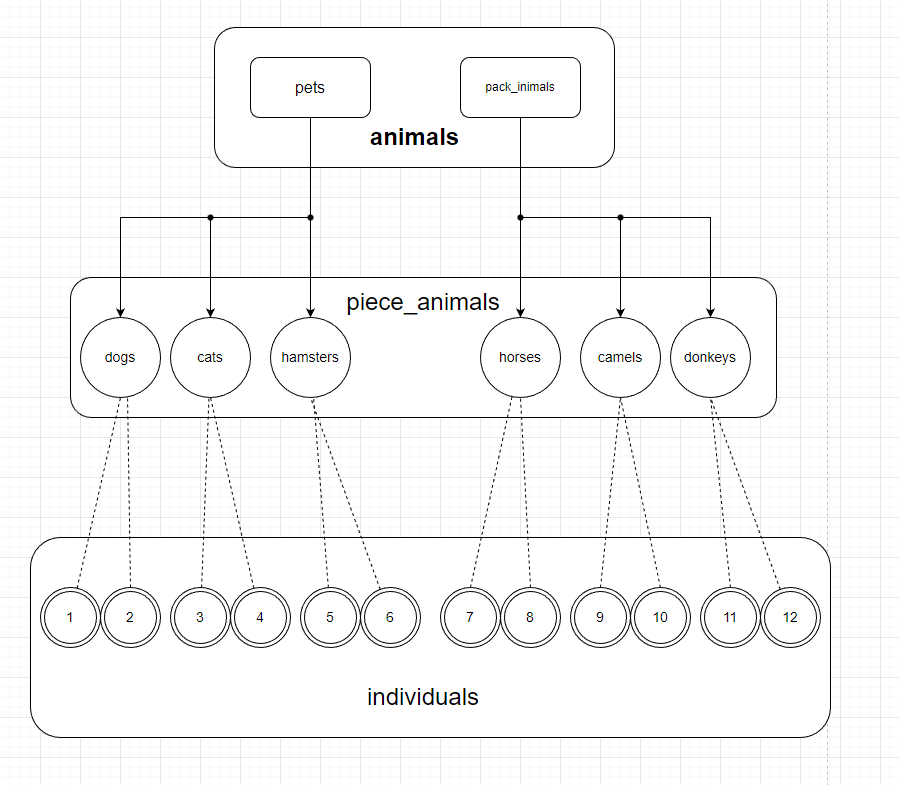

    
7, 8 и 9

    sudo mysql -u root
    mysql> CREATE DATABASE human_friends;
    USE human_friends;

    CREATE TABLE animals (
    id INT PRIMARY KEY AUTO_INCREMENT,
    type_animals VARCHAR(20));

    CREATE TABLE piece_animals (
    id INT PRIMARY KEY AUTO_INCREMENT,
    name VARCHAR(15),
    animals_id INT,
    FOREIGN KEY (animals_id) REFERENCES animals(id) ON DELETE CASCADE);

    CREATE TABLE individuals (
    id INT PRIMARY KEY AUTO_INCREMENT,
    name VARCHAR(15),
    command VARCHAR(10),
    birthday DATE,
    piece_animals_id INT,
    FOREIGN KEY (piece_animals_id) REFERENCES piece_animals(id) ON DELETE CASCADE);

    INSERT INTO animals (type_animals)
    VALUES ('pets'),
    ('pack_animals');

    INSERT INTO piece_animals (name, animals_id)
    VALUES ('dogs', 1),
    ('cats', 1),
    ('hamsters', 1),
    ('horses', 2),
    ('camels', 2),
    ('donkeys', 2);

    INSERT INTO individuals ( name, command, birthday, piece_animals_id)
    VALUES ('FRED', 'Sit ', '2018-07-04', 4),
    ('TUT', 'Play dead', '2017-04-03', 2),
    ('TODDY', 'Jump or Up', '2020-02-23', 3),
    ('LUCKY', 'Right ', '2020-05-18', 2),
    ('KITTY', 'Back-up', '2016-11-01', 5),
    ('PAUL', 'Go to Bed', '2022-03-03', 1),
    ('ROCKY', 'Stand ', '2020-10-24', 6),
    ('QUEEN', 'Left ', '2021-12-18', 2),
    ('SNOWY', 'Down ', '2018-01-01', 3),
    ('CUDDLES', 'Place ', '2019-06-28', 1),
    ('PERKY', 'Eat', '2022-04-03', 5),
    ('CAVALIER', 'Search', '2022-04-18', 3);

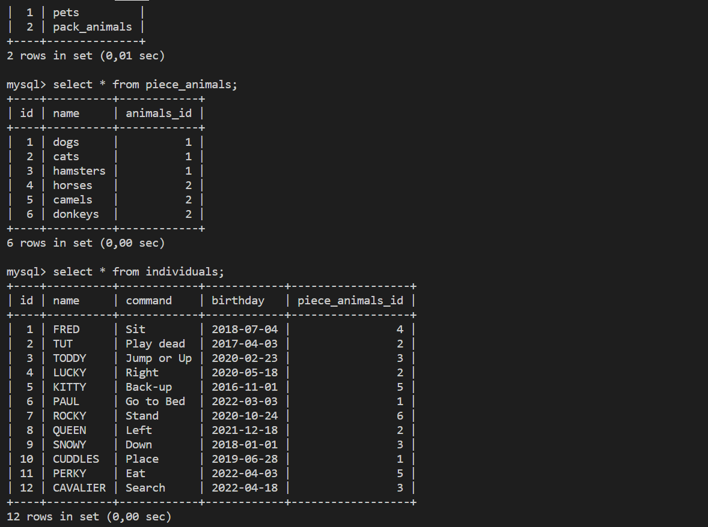

    
10

    DELETE FROM piece_animals 
    WHERE  name LIKE 'camels';

    CREATE TABLE ungulates 
    SELECT * FROM piece_animals 
    WHERE name LIKE 'horses' OR name LIKE 'donkeys';

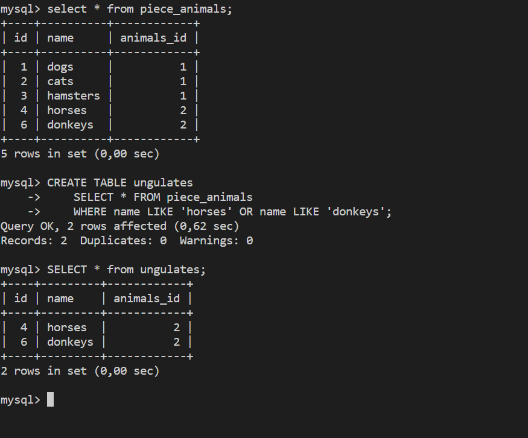

    
11

    CREATE TABLE young_animals 
    SELECT  *,
    TIMESTAMPDIFF(year,birthday,CURDATE()) AS count_years,
    TIMESTAMPDIFF(month,birthday,CURDATE())%12 AS count_months,
    TIMESTAMPDIFF(month,birthday,CURDATE()) AS total_month
    FROM individuals
    WHERE birthday
    BETWEEN "2020-10-04" AND "2023-10-04";

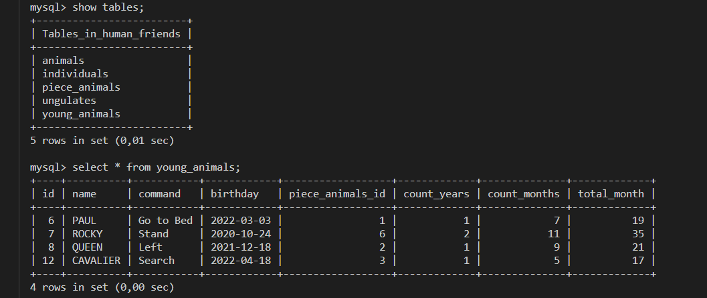

    
12

    SELECT * from individuals
    LEFT JOIN ungulates
    ON individuals.id=ungulates.id
    LEFT JOIN animals
    on individuals.id=animals.id
    LEFT JOIN young_animals
    on individuals.id=young_animals.id
    LEFT JOIN piece_animals
    on individuals.id=piece_animals.id
    ;

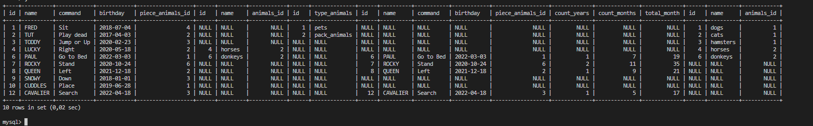

